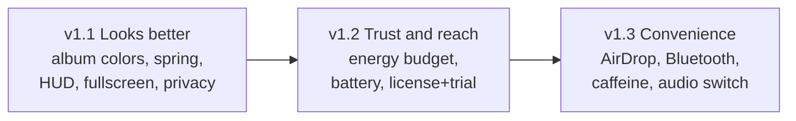

# NotchFlow development roadmap

This document describes the planned direction for NotchFlow releases **v1.1 → v1.3**, plus a curated backlog and a website track. Each release is intentionally small and shippable. Features are scoped to avoid bloat while closing gaps vs. competitors (boring.notch, NotchNook, SuperIsland, Alcove, [Notchy](https://notchy.dev), [notchflow.app](https://notchflow.app)).

**Guiding principle:** competitors lose on **battery drain** and **reliability** (fullscreen, multi-display, macOS updates). They win on **polish** (animations, album colors, minimal UI). We prioritize polish + reliability first, then reach, then convenience features — without becoming a “Swiss Army knife” notch app.

Current tier limits and shipped features: **[free-vs-premium.md](free-vs-premium.md)**

---

## Overview

| Release | Theme | Goal |
|---------|-------|------|
| **v1.1** | Looks better | First impression on par with notchflow.app / Alcove — visual polish and window behaviour |
| **v1.2** | Trust and reach | Prove efficiency, ship battery live activity, enable stable licensing |
| **v1.3** | Convenience | High value-to-complexity features users expect from notch utilities |

---

## v1.1 — Looks better (visual polish + window behaviour)

**Goal:** make the island feel as refined as [notchflow.app](https://notchflow.app) and boring.notch on first hover.

### Features

| Feature | Description | Main code areas |
|---------|-------------|-----------------|
| **Album art colors** | Gradient/glow extracted from track artwork, blending into the island in idle and expanded media views (boring.notch signature “wow”) | `Features/Media/IdleMediaView.swift`, `Views/MediaPlayerView.swift`, `Views/IslandStyle.swift` |
| **Spring animations** | Idle ↔ expanded transitions on spring physics instead of linear/ease curves; optional “Reduce motion” setting | `Core/NotchPanel.swift`, `NotchPanelController` |
| **HUD redesign** | Refreshed volume/brightness overlay styling | `Managers/HUDManager.swift`, `Views/HUDOverlayView.swift` |
| **Keyboard backlight HUD** | Third HUD type for keyboard illumination level (we only have volume + brightness today) | `Managers/HUDManager.swift`, `Views/HUDOverlayView.swift` |
| **Auto-hide in fullscreen** | Island hidden while a fullscreen app is active; opt-out in Settings (top pain point for boring.notch / NotchNook) | `Managers/DisplayManager.swift`, settings |
| **Screen capture privacy** | Island invisible in screenshots and screen recordings (`sharingType = .none`) — boring.notch added this recently and users praised it | `Core/NotchPanel.swift` |

### Planned free vs premium (v1.1)

| Feature | Free | Premium |
|---------|------|---------|
| Album art colors | ✓ | ✓ |
| Spring animations (+ reduce motion) | ✓ | ✓ |
| HUD redesign (volume / brightness) | ✓ | ✓ |
| Keyboard backlight HUD | ✓ | ✓ |
| Auto-hide in fullscreen | ✓ | ✓ |
| Screen capture privacy | ✓ | ✓ |

All v1.1 items are **free** — they improve core UX and reliability for every user.

---

## v1.2 — Trust and reach (business foundation)

**Goal:** earn trust on battery/performance, add standard live activities, and ship stable licensing.

### Features

| Feature | Description | Main code areas |
|---------|-------------|-----------------|
| **Localization** | ~~English-only UI~~ → **Shipped early (v1.0.15+):** en source + pl, de, it, es via String Catalog; in-app language picker | `Core/L10n.swift`, `Resources/Localizable.xcstrings` |
| **Energy budget as contract** | Idle CPU/energy measurement in `Scripts/` (powermetrics checklist before release); target &lt; 0.5% CPU idle; “Energy” section in README with numbers | `Scripts/`, `docs/performance.md`, `README.md` |
| **Battery / charging live activity** | Live activity when plugged in + pulse on low battery + indicator in idle wings — standard feature across boring.notch, SuperIsland, Notchly, Alcove | New manager, `Models/LiveActivity.swift` |
| **License enforcement + trial** | Flip `LicenseMode` to enforced on stable; consider 7-day trial in Polar (notchflow.app uses 3-day trial successfully) | `Licensing/LicenseManager.swift`, `docs/polar-setup.md` |

### Planned free vs premium (v1.2)

| Feature | Free | Premium |
|---------|------|---------|
| Localization (en, pl, de, it, es) | ✓ (shipped) | ✓ |
| Energy budget / performance docs | ✓ | ✓ |
| Battery / charging idle indicator | ✓ | ✓ |
| License enforcement | Free tier unchanged; premium gates existing premium features | Premium unlock |

Localization is not a paywall — it expands reach. Battery/charging idle activity follows competitors (typically free).

---

## v1.3 — Convenience (best value-to-complexity ratio)

**Goal:** add a small set of highly requested utilities without expanding scope into widgets or extension SDKs.

### Features

| Feature | Description | Main code areas |
|---------|-------------|-----------------|
| **AirDrop from shelf** | AirDrop drop target in Shelf — standard in boring.notch (avoid their “blank box” bug; implement properly) | `Features/Shelf/ShelfTabView.swift`, `Managers/ShelfManager.swift` |
| **Bluetooth live activity** | Connect/disconnect AirPods/headphones with device battery level in the notch (Notchy & Alcove have it; boring.notch plans it) | New manager, idle live activity views |
| **Caffeine toggle** | “Prevent Mac sleep” quick toggle in the island — cheap to implement, popular in Notchy. Match Notchy’s polish: indefinitely / for a duration / until a clock time, with auto-disable | Settings or focus module |
| **Audio output switch** | Switch output device from media view (optional if UI budget allows) — Notchy ships this as a one-tap switcher | `Views/MediaPlayerView.swift`, media manager |

### Planned free vs premium (v1.3)

| Feature | Free | Premium |
|---------|------|---------|
| AirDrop from shelf | — | ✓ |
| Bluetooth live activity | ✓ | ✓ |
| Caffeine toggle | ✓ | ✓ |
| Audio output switch | ✓ | ✓ (or ✓ free if kept minimal) |

AirDrop extends **Premium shelf** (already gated: more pins, ZIP staging). Other v1.3 items are convenience toggles available to all users.

---

## Backlog — ideas worth stealing from Notchy (v1.4+, unscheduled)

[Notchy](https://notchy.dev) (free, 30+ features, ~0% idle CPU) is currently the most complete notch app and the best-executed one. Most of its catalog is deliberately **out of scope** for us (see non-goals), but a handful of items have an excellent value-to-complexity ratio and fit NotchFlow’s focus. These are candidates for releases after v1.3 — pick per release, never all at once:

| Idea (Notchy feature) | Why it fits NotchFlow | Rough cost |
|-----------------------|------------------------|------------|
| **Command palette** (Notchy: ⌃⌥K) | One keystroke to any tab / toggle / timer — power-user feature that pairs perfectly with our existing URL scheme and HTTP API actions | Medium |
| **Screenshot shelf** | Every screenshot auto-staged on the notch as a draggable island — natural extension of our Shelf, no new module | Low–medium |
| **Download finished alerts** | Island pops when a file lands in Downloads, one-tap “Reveal in Finder”; works via FSEvents, no browser extension | Low |
| **Drive eject island** | USB drive plugged in → island with one-tap Eject + “safe to disconnect” confirmation | Low |
| **Device battery** (Magic Mouse / Keyboard / Trackpad) | Cheap superset of our planned v1.3 Bluetooth live activity — same IOKit/Bluetooth plumbing | Low (on top of v1.3) |
| **Run Apple Shortcuts** | Grid of one-tap Shortcut chips in the island — high leverage for automation users, complements Raycast integration | Medium |
| **Menu bar detach** | Pop a tab (clipboard, timer) out of the notch into a menu-bar popover — helps non-notch / external-display setups | Medium |
| **Synced lyrics** (LRCLIB) | Signature “wow” on top of our media view; free API, offline-friendly caching | Medium |
| **Hide the notch** (black menu bar) | Trivial to build, frequently searched for — good acquisition feature | Low |
| **Zip & unzip on shelf** | We already have ZIP staging in Premium shelf — extend to unzip via native `ditto` | Low |

**Explicitly not adopted from Notchy** (consistent with non-goals below): AI usage tracker, Zoom teleprompter (Cuely), live weather, Apple Reminders capture, image converter, knock-to-control. Great features — wrong app.

---

## Website track — notchy.dev sets the visual bar

Notchy’s site ([notchy.dev](https://notchy.dev)) is the reference for what a notch-app landing page should look like in 2026. It converts because every claim is **demonstrated, measured, or sourced**. Our `website/` should adopt the same principles, incrementally (this track is independent of app releases):

### What notchy.dev does right — and what we adopt

| notchy.dev pattern | What we build in `website/` | Priority |
|--------------------|------------------------------|----------|
| **Real screen recordings** in hover-to-preview feature cards (“hover a card to preview, click for full-screen”) | Replace static screenshots (`screeny notchflow pl/`) with short muted `.mp4`/`.webm` loops per feature; hover-play, click-to-expand | High |
| **Idle CPU benchmark with methodology** (chart: Notchy ~0% vs Electron 0.46%, with reproducible `ps` method) | Publish our own measured numbers from the v1.2 energy-budget scripts, including method — honesty is the differentiator | High (lands with v1.2) |
| **Honest side-by-side comparison table** (feature × competitor, “no affiliates”) | Comparison table NotchFlow vs boring.notch / NotchNook / Alcove / Notchy — including cells where competitors win | Medium |
| **Live social proof** (downloads counter, “31 active today”, real user quotes with sources) | GitHub release download counts + real quotes once we have them; never fabricate | Medium |
| **Language showcase** (“134 languages” grid) | “Speaks your language” section for en/pl/de/it/es with native names — we already shipped i18n | Low |
| **Frictionless install** (Homebrew cask one-liner next to DMG) | Publish a Homebrew cask (`brew install --cask …/notchflow`) and show it beside the download button | Medium |
| **Request-a-feature CTA** (pre-filled mailto, “ideas ship in the next release”) | Pre-filled mail/GitHub issue template button | Low |
| **Trust footer** (changelog, press kit, uninstall guide) | Link changelog; add short uninstall guide page | Low |
| **SEO landing pages** (“free Alcove alternative”, “Now Playing on the notch”, comparison roundup) | Per-topic subpages in en + pl targeting “notch app” comparison queries | Medium |

### Visual direction

- Keep our identity (we are the polished, minimal, **Polish-first** notch app) — don’t clone Notchy’s layout, adopt its *standards*: motion in previews, measured claims, zero stock imagery.
- Every feature card must show the **actual product**, not an illustration.
- One page, fast, no JS framework needed — same as today’s static `website/`, extended with lazy-loaded videos.

---

## Non-goals (deliberate scope limits)

We explicitly **will not** pursue these — they add maintenance cost or bloat without matching NotchFlow’s focus:

| Non-goal | Why |
|----------|-----|
| **JS Extension SDK** (SuperIsland-style) | Huge maintenance surface; local HTTP API + URL scheme + Raycast cover automation |
| **Weather, widgets, teleprompters, AI trackers** | “Combines everything” direction — NotchNook’s bloat reputation. Notchy ships all of these for free; we can’t out-feature a free 30-feature app, so we compete on focus, polish, and premium depth instead |
| **Intel Mac support / lowering macOS minimum** | Stay on **macOS 14+**, **Apple Silicon**, notched MacBook required |
| **Major notes / clipboard / calendar expansions** | Polish only; no large module rewrites |

---

## How this roadmap relates to releases

- **Marketing version** (`1.0`, `1.1`, …) bumps for user-visible milestones (see `CHANGELOG.md`, git tags `v1.0.N`).
- **Build number** increments every signed release (Sparkle `sparkle:version`).
- When a roadmap item ships, update:
  1. This file (mark done or move to changelog)
  2. [free-vs-premium.md](free-vs-premium.md)
  3. [README.md](../README.md) feature table
  4. Website pricing section if tiers change

---

## Competitor context (why these priorities)

| Pain / opportunity | Source | Our response |
|--------------------|--------|--------------|
| Battery drain (~5%/h idle) | NotchNook, boring.notch #338 | v1.2 energy budget + measurement |
| Fullscreen overlap | boring.notch, NotchNook | v1.1 auto-hide in fullscreen |
| Visual polish / album colors | boring.notch, notchflow.app | v1.1 album colors + spring |
| English / i18n | Growth blocker | Shipped v1.0.15+ (accelerated from v1.2 plan) |
| Battery in notch | All major competitors | v1.2 battery live activity |
| AirDrop, Bluetooth, caffeine | boring.notch, Notchy, Alcove | v1.3 convenience pack |
| Free 30-feature competitor with measured ~0% idle CPU | Notchy (notchy.dev) | Compete on focus + premium depth, cherry-pick best ideas (backlog above), match their proof-driven website |
| Website that demonstrates instead of claims (recordings, benchmarks, comparison table) | notchy.dev | Website track: video feature cards, published energy numbers, honest comparison |

---

*Last updated: 2026-07-15 — aligned with product plan v1.1–v1.3; extended with Notchy (notchy.dev) backlog and website track.*
